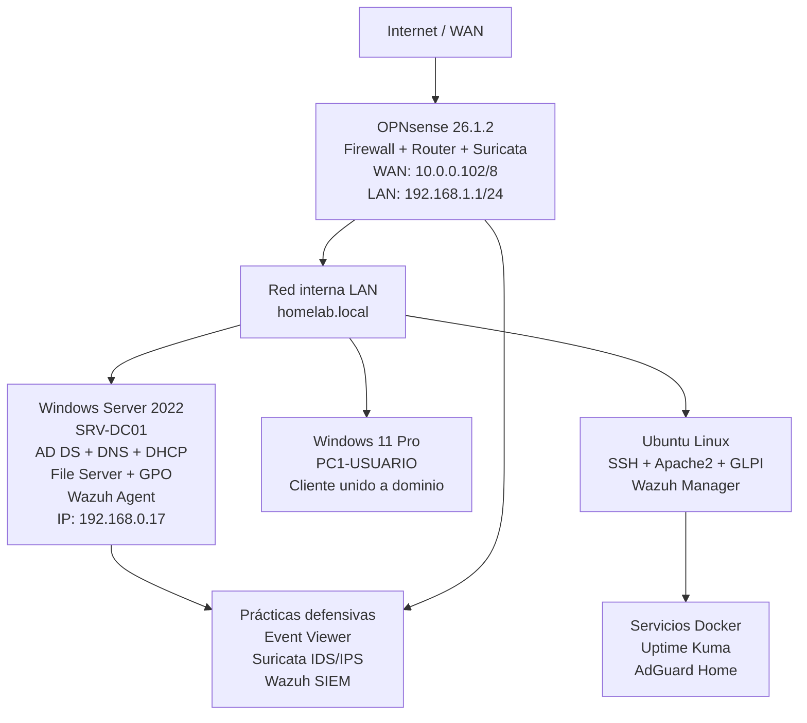

# 🏠 IT Infrastructure & Security Homelab — Boris Pintos

> Laboratorio virtualizado para practicar administración de sistemas, redes, automatización, monitorización y seguridad defensiva en un entorno controlado.

Este proyecto documenta la construcción de una pequeña infraestructura corporativa de laboratorio usando **Windows Server, Active Directory, Linux, OPNsense, Docker, Wazuh, Suricata, GLPI y Veeam**. El objetivo no es simular una empresa completa, sino demostrar competencias prácticas y transferibles a roles de **IT Support, Junior SysAdmin y operaciones de infraestructura**.

---

## Qué Demuestra Este Proyecto

- Despliegue y administración de un entorno Windows con **Active Directory, DNS, DHCP, GPOs y permisos NTFS**.
- Integración de clientes y servicios dentro de una red de laboratorio con validaciones de conectividad.
- Segmentación de red con **OPNsense**, reglas de firewall, DMZ, red de invitados y filtrado DNS.
- Uso de herramientas de monitorización, backup e ITSM: **Uptime Kuma, Performance Monitor, Veeam y GLPI**.
- Prácticas de seguridad defensiva: auditoría de eventos Windows, Wazuh, Suricata IDS/IPS y simulaciones controladas.
- Automatización básica con **PowerShell y Bash** para tareas repetitivas de administración.
- Documentación técnica con capturas, tablas de parámetros, resultados y limitaciones.

---

## Mapa Rápido

| Área | Qué incluye | Competencias demostradas |
|---|---|---|
| Windows Server & AD | DC, DNS, DHCP, GPO, File Server, PXE | Administración de infraestructura Microsoft |
| Linux & Automatización | SSH, permisos, alias, scripts PowerShell | Operaciones, scripting y troubleshooting |
| Redes & Perímetro | OPNsense, LAN/DMZ/Guest, proxy, AdGuard | Segmentación, firewalling y servicios de red |
| Monitorización & Continuidad | Uptime Kuma, Performance Monitor, Veeam | Observabilidad básica, backup y recuperación |
| Seguridad Defensiva | Event Viewer, Wazuh, Suricata, Hydra controlado | Detección, logs y análisis de eventos |
| ITSM | GLPI integrado con LDAP/AD | Ticketing, inventario y soporte técnico |

---

## Alcance del Laboratorio

El laboratorio está montado sobre máquinas virtuales y servicios self-hosted. Algunas pruebas reproducen patrones de entornos corporativos, pero siempre dentro de una red aislada y con máquinas propias.

Las secciones de seguridad deben leerse como **prácticas defensivas de aprendizaje**: configuración, observación de logs, detección y validación de controles. No pretende presentarse como experiencia profesional de analista de seguridad, sino como evidencia de base técnica y capacidad de aprendizaje aplicada.

---

## 🗺️ Arquitectura General del Laboratorio



---

## Área 1 — Infraestructura Windows y Active Directory

> **Objetivo:** Desplegar y administrar una red corporativa aislada con gestión centralizada de usuarios, políticas de grupo y monitorización de rendimiento, replicando servicios habituales de un entorno Active Directory.

### 1.1 · Controlador de Dominio en Windows Server 2022

El servidor actúa simultáneamente como **Domain Controller**, servidor **DNS** autoritativo y servidor **DHCP** para la red interna. La configuración de red es estática para garantizar la estabilidad del servicio de directorio.

| Parámetro         | Valor                           |
|-------------------|---------------------------------|
| Rol principal     | AD DS + DNS                     |
| IP estática       | `192.168.0.17`                  |
| Subred            | `255.255.255.0`                 |
| Gateway           | `192.168.0.1`                   |
| DNS primario      | `192.168.0.17` (sí mismo)       |
| DNS secundario    | `8.8.8.8`                       |
| Nombre de dominio | `homelab.local`                 |


*Server Manager confirma el estado operativo del servidor. La ventana de propiedades IPv4 muestra la asignación de IP estática con el DC como su propio servidor DNS primario — práctica estándar en entornos Active Directory.*

---

### 1.2 · Integración de Cliente Windows 11 al Dominio

El equipo cliente `PC1` fue unido correctamente al dominio `homelab.local`, lo que valida el funcionamiento del controlador de dominio y la resolución DNS interna. Desde este punto, el equipo queda bajo la gestión centralizada de **Group Policy Objects (GPOs)**.


*La pantalla "Acerca de" de Windows 11 confirma la pertenencia al dominio. Este paso requiere que el DNS del cliente apunte al DC y que la comunicación de red entre ambas VMs esté correctamente enrutada.*

---

### 1.3 · Verificación de Conectividad — Intranet

Validación de conectividad extremo a extremo entre `PC1` y el servidor mediante **ICMP**, confirmando que el enrutamiento interno y la configuración de red son funcionales.


*La prueba de ping desde el cliente hacia la IP del controlador de dominio valida tres capas simultáneamente: la configuración de red de la VM, las reglas de firewall del servidor y el enrutamiento interno de VirtualBox.*

---

### 1.4 · Gestión Centralizada de Políticas con Group Policy Management

Uso de la consola **Group Policy Management (GPMC)** para administrar y desplegar políticas de dominio en `homelab.local`. Desde esta herramienta se gestionan GPOs que aplican configuraciones automáticas a todos los equipos y usuarios del dominio — incluyendo la programación de actualizaciones de sistema.


| Elemento               | Detalle                                              |
|------------------------|------------------------------------------------------|
| Forest                 | `homelab.local`                                      |
| Baseline DC            | `WIN-RMH839Q6RKN.homelab.local`                      |
| OUs gestionadas        | Domain Controllers, Empleados                        |
| GPOs configurables     | Default Domain Policy, Starter GPOs, WMI Filters     |

*La GPMC centraliza el ciclo de vida de todas las políticas del dominio. Permite crear, vincular y forzar GPOs que se aplican automáticamente al inicio de sesión o al reiniciar los equipos — sin necesidad de intervención manual en cada máquina.*

---

### 1.5 · Monitorización de Rendimiento con Performance Monitor

Uso de **Windows Performance Monitor** para analizar contadores de sistema en tiempo real: CPU, memoria, disco e I/O de red. Esta herramienta es esencial para el diagnóstico proactivo de cuellos de botella en entornos de servidor.


*La monitorización continua de contadores de rendimiento es una práctica fundamental de operaciones (OPS) que permite detectar degradación del servicio antes de que impacte al usuario final.*

---

### 1.6 · Configuración de File Server y Permisos NTFS

Implementación del rol **File and Storage Services** en Windows Server 2022, creando un servidor de archivos corporativo con control de acceso granular mediante **permisos NTFS**. El modelo de permisos basado en grupos de Active Directory garantiza que cada usuario acceda únicamente a los recursos que le corresponden según su rol en el dominio.


| Parámetro           | Valor                                         |
|---------------------|-----------------------------------------------|
| Rol instalado       | File and Storage Services                     |
| Protocolo de acceso | SMB (recurso compartido de red)               |
| Modelo de permisos  | NTFS + Share, basado en grupos de AD          |
| Cliente de prueba   | PC1 — Windows 11 unido a `homelab.local`      |

*El doble modelo de permisos (Share + NTFS) es el estándar corporativo: los permisos de Share determinan el acceso desde la red, mientras que los NTFS actúan como segunda capa aplicada sobre el sistema de archivos local. El permiso efectivo siempre es el más restrictivo de los dos.*

---

### 1.7 · Despliegue de Imagen por Red — PXE Boot (IPv4)

Configuración de la infraestructura de **arranque PXE** (Preboot Execution Environment) sobre la red interna, aprovechando el servidor DHCP existente en Windows Server 2022 para proporcionar las opciones de red necesarias. PXE permite arrancar un equipo directamente desde la red sin ningún medio físico, transfiriendo una imagen del sistema operativo desde un servidor centralizado.


| Componente     | Valor                                               |
|----------------|-----------------------------------------------------|
| Protocolo      | PXE sobre IPv4                                      |
| Servidor DHCP  | Windows Server 2022 (`192.168.0.17`)                |
| Red PXE        | ✅ Negociación DHCP y arranque PXE validados        |
| Limitación     | Despliegue de imagen interrumpido por I/O del hipervisor |

> **Nota técnica:** El despliegue completo de la imagen fue interrumpido por limitaciones de rendimiento de I/O en VirtualBox — las operaciones de escritura masiva durante el despliegue saturan el bus de almacenamiento virtual. La infraestructura de red PXE, la negociación DHCP y el arranque inicial del cliente por red fueron validados correctamente.

*PXE es la base de los sistemas de despliegue masivo empresariales (WDS, MDT, SCCM/MECM). Dominar su infraestructura subyacente — opciones DHCP 66/67, TFTP, bootloader — es un prerequisito para cualquier administrador de sistemas que gestione despliegues a escala.*

---

### 1.8 · Backup y Disaster Recovery — Veeam Backup & Replication

Despliegue de **Veeam Backup & Replication** para practicar copias de seguridad en entornos virtualizados. Permite crear backups consistentes de las máquinas virtuales, programar trabajos incrementales y validar puntos de restauración.


| Parámetro            | Valor                                        |
|----------------------|----------------------------------------------|
| Herramienta          | Veeam Backup & Replication                   |
| Tipo de backup       | Backup incremental de VMs (imagen completa)  |
| Hipervisor           | Oracle VirtualBox                            |
| Resultado            | ✅ Puntos de restauración creados y validados |

*El ejercicio permite practicar conceptos habituales de backup empresarial: consistencia de la VM, planificación de jobs, retención y comprobación de puntos de restauración. Aunque el laboratorio usa VirtualBox, el flujo de trabajo es transferible a entornos con VMware o Hyper-V.*

---

## Área 2 — Linux & Automatización

> **Objetivo:** Demostrar capacidad de scripting, administración remota segura y optimización del entorno de trabajo en Linux mediante la automatización de tareas repetitivas de Help Desk y el control estricto de permisos.

### 2.1 · Creación Masiva de Usuarios en Active Directory (PowerShell)

Aprovisionamiento automatizado de cuentas de usuario corporativas en la Unidad Organizativa `Empleados` del dominio `homelab.local`. Los usuarios (**Ana, Carlos, Contabilidad, David, Elena, Juan Perez, Sofia**) fueron creados mediante un script de **PowerShell** en lugar de hacerlo manualmente uno a uno, eliminando el error humano y reduciendo el tiempo de onboarding.


*La consola de Active Directory Users and Computers muestra la OU `Empleados` con todas las cuentas activas. Al fondo, PowerShell ISE evidencia el entorno de scripting utilizado. El DNS Manager confirma la zona de búsqueda directa `homelab.local` operativa.*

**Habilidades demostradas:** `New-ADUser`, iteración con `ForEach`, gestión de OUs, atributos de cuenta (nombre, contraseña, grupo).

---

### 2.2 · Optimización del Entorno Linux con Alias en `.bashrc`

Configuración del archivo `/home/Boris/.bashrc` con un conjunto de **alias personalizados** para acelerar las operaciones diarias de administración de sistemas.


| Alias       | Comando real                              | Propósito                          |
|-------------|-------------------------------------------|------------------------------------|
| `actualizar`| `sudo apt update && sudo apt upgrade -y`  | Actualización completa del sistema |
| `ports`     | `netstat -tulanp`                         | Auditoría de puertos activos       |
| `extip`     | `curl icanhazip.com`                      | IP pública del equipo              |
| `mem5`      | `ps auxf \| sort -nr -k 4 \| head -5`    | Top 5 procesos por RAM             |
| `cpu5`      | `ps auxf \| sort -nr -k 3 \| head -5`    | Top 5 procesos por CPU             |
| `ll`        | `ls -alF`                                 | Listado detallado con permisos     |
| `nbash`     | `nano .bashrc`                            | Edición rápida del perfil          |

---

### 2.3 · Gestión Remota Segura con SSH y Control de Permisos

Conexión desde el equipo Windows al servidor Linux mediante **SSH**, demostrando administración remota segura. Durante la sesión se ejecutaron operaciones de control de permisos con `chown` y `chmod`, replicando tareas habituales de administración Linux.


*La sesión SSH inter-VM demuestra: autenticación remota, navegación del sistema de archivos y aplicación del modelo de permisos POSIX (`rwxr-xr-x`) — equivalente Linux al modelo NTFS/Share de Windows.*

---

### 2.4 · Monitorización Proactiva de Servicios — Network Health Checker (PowerShell)

Script de **monitorización de infraestructura** desarrollado en PowerShell que verifica automáticamente el estado de los tres nodos críticos del laboratorio: conectividad ICMP y disponibilidad del puerto de servicio principal en cada servidor. El resultado se exporta en formato **CSV** para facilitar la revisión y el seguimiento histórico del estado de la red.

```powershell
$Servers = @(
    @{ Name = "SRV-DC01";        IP = "10.0.0.5";   Port = 53;  Service = "DNS / Active Directory" },
    @{ Name = "Ubuntu-Linux";    IP = "10.0.0.101"; Port = 22;  Service = "SSH"                    },
    @{ Name = "Router-OPNsense"; IP = "10.0.0.1";   Port = 443; Service = "Web GUI / HTTPS"        }
)

$Results = foreach ($Server in $Servers) {
    $Ping      = Test-Connection -ComputerName $Server.IP -Count 1 -Quiet
    $PortCheck = if ($Ping) { Test-NetConnection -ComputerName $Server.IP -Port $Server.Port -InformationLevel Quiet } else { $false }
    $Status    = if ($Ping -and $PortCheck) { "ONLINE" } elseif ($Ping) { "PUERTO CERRADO" } else { "OFFLINE" }

    [PSCustomObject]@{ Servidor = $Server.Name; IP = $Server.IP; Servicio = $Server.Service; Puerto = $Server.Port; Estado = $Status }
}

$Results | Format-Table -AutoSize
$Results | Export-Csv -Path "C:\Reports_Escaner\Estado_Red.csv" -NoTypeInformation
```

| Nodo             | IP            | Puerto | Servicio               |
|------------------|---------------|--------|------------------------|
| SRV-DC01         | `10.0.0.5`    | 53     | DNS / Active Directory |
| Ubuntu-Linux     | `10.0.0.101`  | 22     | SSH                    |
| Router-OPNsense  | `10.0.0.1`    | 443    | Web GUI / HTTPS        |

*El script distingue tres estados: `ONLINE` (ping y puerto accesible), `PUERTO CERRADO` (host activo pero servicio no responde) y `OFFLINE` (sin conectividad). El reporte CSV en `C:\Reports_Escaner\Estado_Red.csv` permite comparar ejecuciones sucesivas y detectar degradación de servicio antes de que impacte al usuario.*

**Habilidades demostradas:** `Test-Connection`, `Test-NetConnection`, `[PSCustomObject]`, `Export-Csv`, iteración `foreach`.

---

### 2.5 · Monitorización de Disponibilidad — Uptime Kuma (Docker)

Despliegue de **Uptime Kuma**, herramienta de monitorización self-hosted de alta disponibilidad ejecutada en Docker. Proporciona monitorización continua de servicios mediante HTTP/HTTPS, TCP y DNS, con alertas configurables y panel de estado en tiempo real — alternativa open-source a UptimeRobot con control total sobre los datos y sin límite de monitores.


| Parámetro       | Valor                                         |
|-----------------|-----------------------------------------------|
| Imagen Docker   | `louislam/uptime-kuma`                        |
| Protocolos      | HTTP · HTTPS · TCP · DNS                      |
| Servicios monitorizados | Nodos críticos del homelab            |
| Resultado       | ✅ Monitorización continua operativa           |

*Uptime Kuma complementa el Health Checker de PowerShell de la sección 2.4: mientras el script genera informes bajo demanda, Uptime Kuma monitoriza de forma continua y alerta en el instante en que un servicio cae — cerrando el ciclo de observabilidad del laboratorio con detección proactiva.*

---

## Área 3 — Seguridad Defensiva Aplicada 🛡️

> **Objetivo:** Implementar controles de seguridad en capas: auditoría de accesos, endurecimiento del perímetro, IDS/IPS con reglas conocidas y simulaciones controladas para entender cómo se generan, detectan y analizan eventos de seguridad.

### 3.1 · Auditoría de Accesos con Event Viewer — Event ID 4663

Configuración de políticas de **Object Access Auditing** en Windows y análisis del **Event ID 4663** ("Se intentó acceder a un objeto") en el Security Log. Este evento es crítico en la investigación forense: registra qué usuario accedió a qué archivo, desde qué proceso y en qué momento exacto.


| Campo del evento | Valor                      |
|------------------|----------------------------|
| Event ID         | `4663`                     |
| Log              | Security (Windows Logs)    |
| Task Category    | File System                |
| Fuente           | Microsoft Windows security |

*El filtrado por Event ID en el Security Log es una técnica fundamental de **SIEM triage**: permite aislar eventos específicos entre miles de registros y reconstruir la línea temporal de un incidente.*

---

### 3.2 · Hardening de Red — Regla de Firewall Personalizada

Creación de una regla **Inbound** personalizada en Windows Defender Firewall (`Bloqueo_Ping_Entrante`) bloqueando solicitudes ICMP entrantes, reduciendo la superficie de ataque visible en un network scan.


*Un host que no responde a ping es invisible en un barrido con `nmap -sn`, dificultando la fase de reconocimiento de un atacante.*

---

### 3.3 · Simulación de Ataque — Fuerza Bruta RDP con Hydra (Kali Linux)

Ejecución de un ataque de diccionario contra **RDP** (puerto 3389) desde Kali Linux utilizando **Hydra**, simulando la técnica de **credential stuffing** usada por actores de amenaza reales.

```bash
hydra -t 1 -l sofia.perez -P dictionary.txt rdp://10.0.0.100
```


| Parámetro   | Valor                              |
|-------------|------------------------------------|
| Herramienta | Hydra v9.0                         |
| Protocolo   | RDP (puerto 3389)                  |
| Target      | `10.0.0.100`                       |
| Resultado   | 0 contraseñas válidas encontradas  |

> ⚠️ **Entorno controlado:** Ejecutado exclusivamente dentro de la red virtual aislada del laboratorio, contra máquinas propias.

**Perspectiva defensiva:** Cada intento fallido genera un **Event ID 4625** en el Security Log. En un entorno monitorizado, este tipo de evento podría alimentar una alerta cuando supera un umbral, por ejemplo más de 5 intentos en 60 segundos.

---

### 3.4 · Firewall Perimetral — OPNsense (FreeBSD)

Despliegue de **OPNsense 26.1.2_5** como firewall y router perimetral, proporcionando inspección de tráfico, NAT y segmentación entre la WAN y la LAN interna.


| Interfaz | Adaptador | Dirección IP         | Tipo     |
|----------|-----------|----------------------|----------|
| LAN      | `em0`     | `192.168.1.1/24`     | Estática |
| WAN      | `em1`     | `10.0.0.102/8`       | DHCP     |

---

### 3.5 · IDS/IPS con Suricata — Configuración en OPNsense

Activación del motor **Suricata** integrado en OPNsense como **IPS (Intrusion Prevention System)** en modo `Netmap`, capturando tráfico directamente en la interfaz WAN. El modo promiscuo permite inspeccionar todo el tráfico que atraviesa el firewall, no solo el dirigido a él.


| Parámetro       | Valor           |
|-----------------|-----------------|
| Motor           | Suricata (integrado en OPNsense) |
| Modo            | Netmap (IPS)    |
| Interfaz        | WAN             |
| Promiscuous     | Activado        |
| Rotación de log | Semanal         |

*La diferencia entre IDS e IPS es crítica: en modo IDS el tráfico malicioso se registra pero no se detiene; en modo **IPS con Netmap** Suricata actúa inline y puede bloquear el paquete antes de que llegue a la red interna.*

---

### 3.6 · IDS/IPS con Suricata — Reglas Emerging Threats Open

Descarga y habilitación de los rulesets **ET Open** (Emerging Threats Open), un conjunto de firmas comunitario muy utilizado para detección de amenazas. Estos rulesets cubren categorías como escaneo de red, shellcode, SMTP malicioso y otras técnicas de ataque activas.


*La pestaña "Download" del módulo Intrusion Detection permite seleccionar y actualizar los rulesets de forma centralizada. `ET open/emerging-scan` detecta técnicas de reconocimiento activo como los escaneos de puertos — directamente relevante para detectar la fase inicial de un ataque.*

---

### 3.7 · Detección y Bloqueo de Ataque en Tiempo Real

Con Suricata activo y los rulesets ET Open habilitados, el tráfico generado desde **Kali Linux** (`10.0.0.103`) hacia la red interna fue detectado y **bloqueado automáticamente** en tiempo real, sin intervención manual.


| Campo       | Valor                              |
|-------------|------------------------------------|
| Fecha       | 2026/04/26 14:58                   |
| Acción      | `blocked`                          |
| Origen      | `10.0.0.103` (Kali Linux) via LAN  |
| SID activo  | `2024364`                          |
| WAN bloqueado | `216.58.204.165:443` → `192.168.0.21` |

*El log de alertas muestra múltiples eventos `blocked` contra la misma IP de Kali, confirmando que Suricata actuó como IPS real: no solo detectó el patrón malicioso sino que descartó los paquetes antes de que alcanzaran el destino. Esto cierra el ciclo ofensiva/defensiva del laboratorio.*

---

### 3.8 · Filtrado DNS en la Red — AdGuard Home desplegado con Docker

Despliegue de **AdGuard Home** como servidor DNS recursivo con filtrado de contenido, ejecutándose en un contenedor **Docker** y escuchando en el puerto estándar DNS (53). Actúa como primera línea de defensa a nivel de red: bloquea dominios maliciosos, trackers y publicidad antes de que el tráfico llegue al endpoint.


| Parámetro         | Valor                          |
|-------------------|--------------------------------|
| Imagen Docker     | `adguard/adguardhome`          |
| Nombre contenedor | `adguardhome`                  |
| Container ID      | `1196204c2259`                 |
| Puerto expuesto   | `53:53` (DNS)                  |
| Puerto admin      | `53:53` + interfaz web `8080`  |
| CPU en reposo     | 0.23%                          |
| Memoria           | ~51.76 MB                      |

*Docker Desktop confirma el contenedor activo con el puerto 53 correctamente mapeado al host. Usar Docker para desplegar AdGuard Home aísla el servicio del sistema operativo subyacente y simplifica su actualización y portabilidad.*


| Métrica (últimas 24h)       | Valor        |
|-----------------------------|--------------|
| DNS Queries totales         | 90           |
| Bloqueadas por filtros      | 6 (6.67%)    |
| Tiempo medio de resolución  | 47 ms        |
| Top client                  | `172.17.0.1` (red bridge Docker) |
| Top dominio bloqueado       | `adtcdn.unidadeditorial.es` |

*El dashboard consolida en una sola vista las consultas DNS de la red, la tasa de bloqueo y los dominios más solicitados. El cliente `172.17.0.1` corresponde a la gateway de la red interna de Docker, confirmando que el contenedor resuelve peticiones desde la propia máquina host. Esta visibilidad DNS ayuda a identificar comportamientos anómalos, como resoluciones repetidas hacia dominios sospechosos.*

---

### 3.9 · Configuración de Proxy Web en la Red

Configuración de un servicio de **proxy** en la infraestructura del laboratorio para controlar y gestionar el tráfico web de los clientes de la red interna. El proxy actúa como intermediario entre los equipos de la LAN y los servicios externos, permitiendo inspección, filtrado y registro centralizado del tráfico HTTP/HTTPS.


| Parámetro          | Valor                                         |
|--------------------|-----------------------------------------------|
| Función            | Proxy web / control de tráfico HTTP           |
| Integración        | Red interna del laboratorio                   |
| Resultado          | ✅ Tráfico enrutado y verificado              |

*Un proxy en la red corporativa es un punto de control central: permite aplicar políticas de acceso, generar logs de tráfico y correlacionar actividad de red en el SIEM. Desde una perspectiva defensiva, el proxy aporta telemetría útil para detectar comportamientos anómalos como peticiones repetidas a dominios sospechosos.*

---

## Área 4 — SIEM y Análisis de Eventos con Wazuh 🔍

> **Objetivo:** Desplegar Wazuh en el laboratorio, conectar el Domain Controller como agente monitorizado y practicar análisis de eventos, detección de vulnerabilidades, correlación con MITRE ATT&CK y revisión de controles de configuración.

### 4.1 · Despliegue del Agente Wazuh en SRV-DC01

Instalación y conexión del agente **Wazuh v4.7.5** en el Domain Controller (`SRV-DC01`), registrado con cobertura del 100% de los agentes del laboratorio. El agente reporta en tiempo real al servidor Wazuh.


| Parámetro          | Valor                                     |
|--------------------|-------------------------------------------|
| Agente ID          | `001`                                     |
| Nombre             | `SRV-DC01`                                |
| IP                 | `10.0.0.5`                                |
| Sistema operativo  | Windows Server 2022 Standard (10.0.20348) |
| Versión agente     | Wazuh v4.7.5                              |
| Cluster node       | `node01`                                  |
| Estado             | Active ✅                                  |

---

### 4.2 · Dashboard del Agente — MITRE, SCA y Compliance

El panel de detalle del agente agrega múltiples dimensiones de análisis en una sola vista: tácticas MITRE detectadas, estado de cumplimiento PCI DSS y resultados del **Security Configuration Assessment (SCA)** contra el CIS Benchmark.


**Top tácticas MITRE detectadas:**

| Táctica              | Eventos |
|----------------------|---------|
| Defense Evasion      | 181     |
| Privilege Escalation | 180     |
| Persistence          | 178     |
| Initial Access       | 176     |
| Impact               | 25      |

**SCA — CIS Microsoft Windows Server 2022 Benchmark v1.0.0:**

| Resultado   | Controles |
|-------------|-----------|
| Passed      | 127       |
| Failed      | 212       |
| Score       | 37%       |

*Un score SCA del 37% es el punto de partida típico de un servidor recién instalado sin hardening. El valor del ejercicio está en identificar exactamente qué controles fallan para priorizarlos y mejorar la postura de seguridad de forma medible.*

---

### 4.3 · Análisis de Security Events

El dashboard de **Security Events** de Wazuh consolida los eventos del agente en una vista centralizada: evolución temporal de alertas, distribución por grupo de regla y alineación con requisitos PCI DSS.


| Métrica                  | Valor                                                     |
|--------------------------|-----------------------------------------------------------|
| Total eventos (24h)      | 1.849                                                     |
| Top grupos de alerta     | `windows_security`, `sca`, `vulnerability-detector`       |
| Top alertas              | Windows Logon Success/Failure, Multiple Logon Events      |
| Requisitos PCI DSS top   | 11.2.1, 11.2.3, 10.2.5                                   |

*La concentración de eventos en `windows_security` y `authentication_failed` refleja directamente los intentos de fuerza bruta simulados desde Kali Linux — visible en el SIEM como picos en la evolución temporal de alertas.*

---

### 4.4 · Integración con MITRE ATT&CK — Técnica T1110 (Brute Force)

Navegación por el módulo **MITRE ATT&CK** de Wazuh para investigar la técnica **T1110 – Brute Force**, directamente relacionada con el ataque Hydra simulado. Wazuh vincula los eventos detectados con el framework MITRE, incluyendo los grupos APT conocidos que utilizan esta técnica.


*La integración con MITRE ayuda a convertir eventos técnicos en contexto de seguridad: permite relacionar una alerta con tácticas y técnicas conocidas, y entender mejor qué comportamiento se está observando.*

---

### 4.5 · Detección de Vulnerabilidades — 996 CVEs en SRV-DC01

El módulo de **Vulnerability Detection** de Wazuh realizó un escaneo completo del Domain Controller e identificó 996 vulnerabilidades conocidas, clasificadas por severidad con sus CVEs y puntuaciones CVSS.


| Severidad | Cantidad |
|-----------|----------|
| Critical  | 40       |
| High      | 731      |
| Medium    | 223      |
| Low       | 2        |
| **Total** | **996**  |

**CVEs de alta severidad (muestra):**

| CVE               | CVSS3 | Severidad |
|-------------------|-------|-----------|
| CVE-2024-38202    | 7.3   | High      |
| CVE-2023-50387    | 7.5   | High      |
| CVE-2024-20683    | 7.8   | High      |
| CVE-2024-20682    | 7.8   | High      |

*El volumen de vulnerabilidades refleja que el servidor opera con la versión de evaluación de Windows Server 2022 sin patches aplicados, un estado deliberado para el laboratorio. El ejercicio sirve para entender cómo priorizar remediación: primero vulnerabilidades críticas, después altas y controles de configuración.*

---

## 🧪 Ejercicios Adicionales

Laboratorios específicos documentados de forma independiente, cada uno con su propio objetivo, configuración detallada y evidencia visual. Haz clic en el ejercicio para ver la documentación completa.

| Ejercicio | Tecnologías clave | Descripción |
|---|---|---|
| [🎫 ITSM & Gestión de Activos con GLPI](Sistema%20de%20Ticketing%20y%20Activos%20con%20GLPI/README.md) | GLPI · Apache2 · LDAP/AD | Despliegue integrado con Active Directory, inventario de activos y gestión de tickets de soporte |
| [🔀 Segmentación de Red — DMZ y Guest](DMZ%20y%20Red%20de%20Invitados/README.md) | OPNsense · Firewall Rules | Interfaces DMZ y Guest aisladas de la LAN con acceso a internet mediante reglas de firewall |

---

## 🧰 Stack Tecnológico Completo

| Categoría           | Tecnología                                                        |
|---------------------|-------------------------------------------------------------------|
| Virtualización      | Oracle VirtualBox                                                 |
| Contenedores        | Docker Desktop · adguard/adguardhome · louislam/uptime-kuma      |
| Sistemas Operativos | Windows Server 2022 · Windows 11 Pro · Ubuntu · Kali Linux        |
| Firewall/Router     | OPNsense 26.1.2 (FreeBSD) · Segmentación DMZ · Red de Invitados  |
| IDS/IPS             | Suricata (integrado en OPNsense) · ET Open Rulesets              |
| Filtrado DNS        | AdGuard Home (Docker) · Bloqueo de trackers y dominios maliciosos |
| SIEM                | Wazuh v4.7.5 · MITRE ATT&CK · SCA · Vulnerability Detection      |
| ITSM                | GLPI · Apache2 · Integración LDAP/Active Directory               |
| Directorio Activo   | Active Directory DS · DNS · DHCP · GPO · GPMC                    |
| File Services       | File and Storage Services · NTFS Permissions · SMB Shares         |
| Despliegue          | PXE Boot (IPv4) · TFTP · DHCP Options 66/67                      |
| Automatización      | PowerShell · Bash · `.bashrc` aliases · Health Checker (CSV)      |
| Seguridad Ofensiva  | Hydra · Kali Linux (entorno controlado)                           |
| Seguridad Defensiva | Windows Event Viewer · Windows Defender Firewall · Suricata IPS · AdGuard Home |
| Administración      | SSH · CMD · PowerShell ISE · Server Manager                       |
| Backup / DR         | Veeam Backup & Replication · Backup incremental de VMs           |
| Monitorización      | Performance Monitor · Uptime Kuma · Event Log · Wazuh SIEM       |
| Proxy               | Proxy web · Filtrado de tráfico HTTP/HTTPS                        |
| Cumplimiento        | CIS Benchmark (Win Server 2022) · PCI DSS                        |

---

## 📌 Estado del Laboratorio

| Área                              | Estado          |
|-----------------------------------|-----------------|
| Infraestructura Windows y AD      | ✅ Completado    |
| File Server & Permisos NTFS       | ✅ Completado    |
| Despliegue PXE Boot               | ✅ Red validada  |
| Linux & Automatización            | ✅ Completado    |
| Monitorización con Health Checker | ✅ Completado    |
| Uptime Kuma (Docker)              | ✅ Completado    |
| Backup con Veeam                  | ✅ Completado    |
| Proxy Web                         | ✅ Completado    |
| Seguridad Defensiva Aplicada      | ✅ Completado    |
| IDS/IPS con Suricata              | ✅ Completado    |
| Filtrado DNS con AdGuard Home     | ✅ Completado    |
| SIEM con Wazuh                    | ✅ Completado    |
| ITSM con GLPI                     | ✅ Completado    |
| Segmentación de Red (DMZ y Guest) | ✅ Completado    |
| Network Topologies (Cisco PT)     | 🔄 En progreso  |

---

<div align="center">

**[Ver perfil de GitHub](https://github.com/BorisPintos) · [LinkedIn](https://www.linkedin.com/in/boris-rodriguez-pintos/)**

</div>

